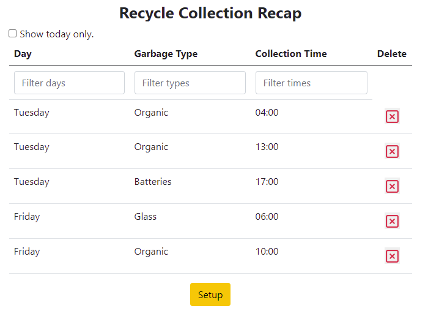

[![Contributors][contributors-shield]][contributors-url]
[![Forks][forks-shield]][forks-url]
[![Stargazers][stars-shield]][stars-url]
[![Issues][issues-shield]][issues-url]
[![MIT License][license-shield]][license-url]
[![LinkedIn][linkedin-shield]][linkedin-url]

<br />
<p align="center">
  <a href="https://github.com/fabio-mancin/recycle">
    
  </a>

  <h3 align="center">Recycle</h3>

  <p align="center">
    PHP/Laravel web app that helps tracking garbage recycling days and times.
    <br />
    <br />
    <a href="https://github.com/fabio-mancin/recycle">View Demo</a>
    ·
    <a href="https://github.com/fabio-mancin/recycle/issues">Report Bug</a>
    ·
    <a href="https://github.com/fabio-mancin/recycle/issues">Request Feature</a>
  </p>
</p>

<details open="open">
  <summary><h2 style="display: inline-block">Table of Contents</h2></summary>
  <ol>
    <li>
      <a href="#about-the-project">About The Project</a>
      <ul>
        <li><a href="#built-with">Built With</a></li>
      </ul>
    </li>
    <li>
      <a href="#getting-started">Getting Started</a>
      <ul>
        <li><a href="#prerequisites">Prerequisites</a></li>
        <li><a href="#installation">Installation</a></li>
      </ul>
    </li>
    <li><a href="#usage">Usage</a></li>
    <li><a href="#roadmap">Roadmap</a></li>
    <li><a href="#contributing">Contributing</a></li>
    <li><a href="#license">License</a></li>
    <li><a href="#contact">Contact</a></li>
    <li><a href="#acknowledgements">Acknowledgements</a></li>
  </ol>
</details>

## About The Project



This is a simple web app developed with PHP/Laravel that I built for a start2Impact course project; it is my first PHP web app, so mistakes are extremely likely! I'd love to get your feedback :)


### Built With

* [PHP](https://www.php.net/)
* [Laravel](http://laravel.com/)
* [NodeJS](https://nodejs.org/en/)

## Getting Started

To get a local copy up and running follow these simple steps.

### Prerequisites

* npm
  ```sh
  npm install npm@latest -g
  ```

* PHP Environment (Apache, PHP, MySQL). I used PHP 7.4.9, MySQL 8, Apache 2.4; retrocompatibility not guaranteed. Depending on your OS your installation might vary; I used [WAMP](https://www.wampserver.com/) on Windows for a quick and effortless setup.

* [Composer](https://getcomposer.org/): depending on your OS follow the instructions on the official website.

### Installation

1. Clone the repo and cd to its root directory
   ```sh
   git clone https://github.com/fabio-mancin/recycle.git

   cd recycle
   ```
2. Install composer dependencies
   ```sh
   composer install
   ```
3. Install NPM packages
   ```sh
   npm install
   ```
5. Copy ".env.example" from the root folder and rename the copy to ".env".
   ```sh
   cp .env.example .env
   ```

6. Generate an app encryption key
   ```sh
   php artisan key:generate
   ```
7. Create an empty database: depending on your setup and system this may vary; you can refer to the [official documentation](https://dev.mysql.com/doc/refman/8.0/en/creating-database.html) or follow the instruction for the software you are using to handle MySQL. The name doesn't matter, I called mine "recycle" for consistency.

8. Update .env with your database connection settings in order to give the app access to it. In the .env file fill in the DB_HOST, DB_PORT, DB_DATABASE, DB_USERNAME, and DB_PASSWORD options to match the credentials of the database you just created.
   ```sh
   DB_CONNECTION=mysql
   DB_HOST=127.0.0.1
   DB_PORT=3306
   DB_DATABASE= yourDatabaseName
   DB_USERNAME= yourRootUsername
   DB_PASSWORD= yourPassword
   ```

9. Run migrations:
   ```sh
   php artisan migrate
   ```

10. Run the server and open the url you are serving it to on your browswer, usually http://127.0.0.1:8000.

    ```sh
    php artisan serve
    ```

<!-- USAGE EXAMPLES -->
## Usage

On startup the application will guide you through the initial setup: garbage collection days, garbage types and finally garbage collection times.

The app will then show the main page with the recycle days recap. You can delete existing collections from it. In addition, you can re-enter setup.

Days and garbage types can be added, modified and removed through the setup.

## Roadmap

See the [open issues](https://github.com/fabio-mancin/recycle/issues) for a list of proposed features (and known issues).

## Contributing

Contributions are what make the open source community such an amazing place to be learn, inspire, and create. Any contributions you make are **greatly appreciated**.

1. Fork the Project
2. Create your Feature Branch (`git checkout -b feature/AmazingFeature`)
3. Commit your Changes (`git commit -m 'Add some AmazingFeature'`)
4. Push to the Branch (`git push origin feature/AmazingFeature`)
5. Open a Pull Request

## License

Distributed under the MIT License. See `LICENSE` for more information.

## Contact

Your Name - [@fabio__mancio](https://twitter.com/fabio__mancio) - fabio.mancin90@gmail.com

Project Link: [https://github.com/fabio-mancin/recycle](https://github.com/fabio-mancin/recycle)

Website: [fabiomancin.org](https://fabiomancin.org)

## Acknowledgements

* [start2impact](start2impact.it)
* [recycling.com](https://www.recycling.com/)
* [clockwork](https://underground.works/clockwork/)

[contributors-shield]: https://img.shields.io/github/contributors/fabio-mancin/recycle.svg?style=for-the-badge
[contributors-url]: https://github.com/fabio-mancin/recycle/graphs/contributors
[forks-shield]: https://img.shields.io/github/forks/fabio-mancin/recycle.svg?style=for-the-badge
[forks-url]: https://github.com/fabio-mancin/recycle/network/members
[stars-shield]: https://img.shields.io/github/stars/fabio-mancin/recycle.svg?style=for-the-badge
[stars-url]: https://github.com/fabio-mancin/recycle/stargazers
[issues-shield]: https://img.shields.io/github/issues/fabio-mancin/recycle.svg?style=for-the-badge
[issues-url]: https://github.com/fabio-mancin/recycle/issues
[license-shield]: https://img.shields.io/github/license/fabio-mancin/recycle.svg?style=for-the-badge
[license-url]: https://github.com/fabio-mancin/recycle/blob/master/LICENSE.txt
[linkedin-shield]: https://img.shields.io/badge/-LinkedIn-black.svg?style=for-the-badge&logo=linkedin&colorB=555
[linkedin-url]: https://linkedin.com/in/fabio-mancin
